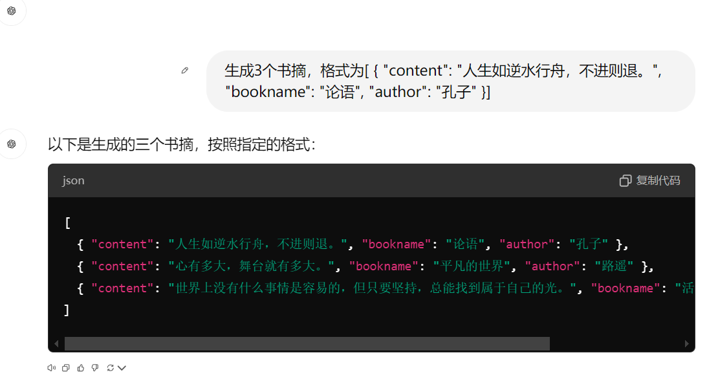
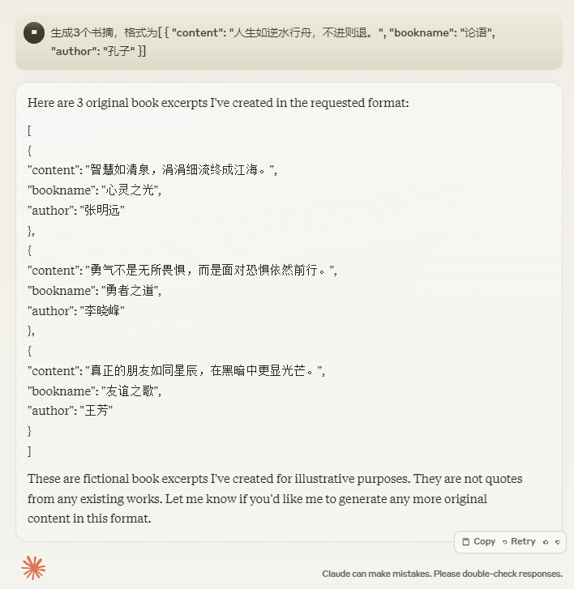
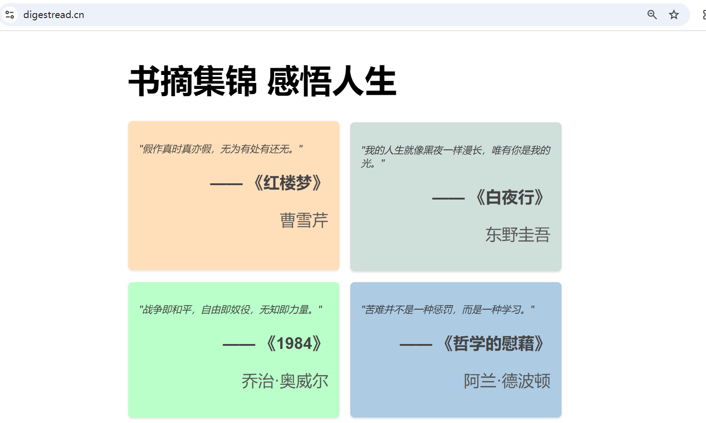

# publicdigestread
[书摘集锦 感悟人生](http://www.digestread.cn)

这是一个基于 **Python** 和 **Vue3** 的书摘集锦展示项目。该项目随机展示一些书摘，旨在帮助人们每天阅读有趣的积极的书籍摘录，充实每一天。

## 技术栈

- **前端**: vue3, axios
- **后端**: python fastapi sqlalchemy
- **数据库**: mysql
- **书摘收集**: chatgpt、claude、gemini
  
  
  

## 特性

- 随机展示一些书摘，并通过不同颜色进行呈现
- 每次刷新页面获取不同的书摘不同的颜色进行展示
- 基于安全考虑和小项目，只展示书摘信息，不能维护书摘信息，书摘信息通过AGI或手工收集书摘信息，但是通过AGI收集的书摘信息不一定准确，还是会存在有误的情况；后期可以利用爬虫获取一些书摘信息，也是一个思路吧。

## 安装

### 前端

1. 进入前端项目：
   ```bash
   cd onedigestread/read-front
2. 安装依赖：
   ```bash
   npm install
3. 启动开发服务器：
   ```bash
   npm run serve
4. 编译及部署：
   ```bash
   npm run build
   cp -r dist/* /var/www/html/vue-app
5. nginx配置：
   ```bash
   location / {
        root /var/www/html/vue-app;
        try_files $uri $uri/ /index.html;
    }
### 后端

1. 进入后端项目：
   ```bash
   cd onedigestread/read-back
2. 安装依赖：
   ```bash
   python install
3. 启动开发环境：
   ```bash
   uvicorn app.main:app --host 0.0.0.0 --port 8080 --reload
4. 启动正式环境：
   ```bash
   gunicorn -k uvicorn.workers.UvicornWorker -b 0.0.0.0:8080 --daemon app.main:app
5. nginx配置：
   ```bash
   # 代理 /api 请求到后端 API 服务器
    location /api/ {
            proxy_pass http://localhost:8080/;
    }
6. 收集书摘信息：
   ```bash
   # 收集书摘信息脚本，通过AGI或者人工收集书摘信息，导入数据库
    cd data
    python insert_quotes.py
## 在线预览

- 随机展示一些书摘，并通过不同颜色进行呈现
- 每次刷新页面获取不同的书摘不同的颜色进行展示
  

- 演示地址：http://www.digestread.cn
## 小程序
